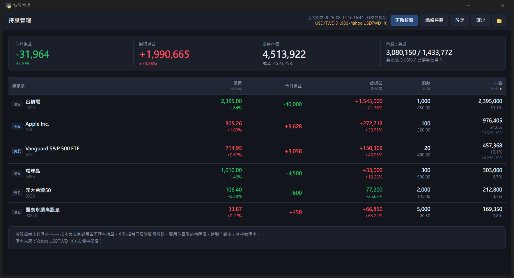

# 持股管理

台股 + 美股的個人持股管理桌面程式。資料存在你自己的電腦，不上傳任何地方。



> 截圖用的是 `docs/範例持股.xlsx` 裡的虛構持股。

## 怎麼用

雙擊 **`啟動.bat`**。

第一次執行會自動產生空白的 `持股.xlsx`。想先看看格式，可以把 [`docs/範例持股.xlsx`](docs/範例持股.xlsx) 複製到專案根目錄改名為 `持股.xlsx`，直接跑跑看。

| 動作 | 做法 |
|---|---|
| 改持股 | 按「**編輯持股**」，直接在程式裡改 |
| 改設定 | 按「**設定**」 |
| 更新報價 | 按「更新報價」，或按 `F5` / `Ctrl+R` |
| 排序 | 點表頭任一欄 |
| 匯出 | 按「匯出」，產生 `data\庫存總覽.xlsx` |

## 編輯持股

按「編輯持股」進入編輯模式，格子裡直接打字。

- **輸入代號會自動帶出名稱與現價**，馬上看得出有沒有打錯
- 市場留「自動」即可，程式從代號判斷台股或美股
- 股數可以打千分位 `38,000`，均價可以帶 `$`
- 有錯的格子會標紅並寫明原因，**修好之前不會存檔，你改的東西也不會不見**
- `Ctrl+S` 儲存、`Esc` 取消

### 同一檔可以填好幾列

分批買進、想分開追蹤各批績效的話，同一個代號可以填多列 —— 每一列各自保留自己的股數與均價，**不會被合併**。

- 編輯時重複的列會標黃框提示「第 1/2 筆，會分開計算」（黃色 = 提醒，紅色才是錯誤）
- 存檔前會跳確認框，避免你只是不小心打重複
- 庫存表上會標 `1/2` `2/2`，讓你知道那不是畫面重複
- 損益各列分開算，總計照樣加總；報價只會查一次，不會重複打 API

儲存時會寫回 `持股.xlsx`（存檔前自動備份）。

⚠️ **存檔時請先關掉 Excel** —— 如果 `持股.xlsx` 正被 Excel 開著會存不進去。程式進入編輯模式時就會提醒你，存檔失敗也會明講原因，你改的內容不會遺失。

你當然也可以照舊直接用 Excel 編輯 `持股.xlsx`，改完回程式按「更新報價」即可。

### 「持股」分頁的欄位

| 欄位 | 必填 | 說明 |
|---|---|---|
| 代號 | ✅ | 台股用數字（`2882`、`00919`），美股用英文（`AAPL`） |
| 名稱 | | 留空會自動補上 |
| 市場 | | `TW` / `US`，留空自動判斷 |
| 股數 | ✅ | 可以打千分位 `38,000` |
| 均價 | ✅ | 你的平均成本 |
| 備註 | | 隨你寫 |

上市、上櫃都支援，程式自動判斷。

範例可看 [`docs/範例持股.xlsx`](docs/範例持股.xlsx)：

| 代號 | 名稱 | 市場 | 股數 | 均價 | 備註 |
|---|---|---|---|---|---|
| 2330 | | TW | 1000 | 850 | 上市個股 |
| 0050 | | TW | 2000 | 145 | ETF，代號 0 開頭也不會被吃掉 |
| 00878 | | TW | 5000 | 20.5 | 高股息 ETF |
| 6488 | | TW | 300 | 900 | 上櫃股票，程式會自動改走櫃買 |
| AAPL | | | 100 | 220 | 美股：市場留空會自動判斷 |
| VOO | | US | 20 | 480 | 美股 ETF |

## 設定

按「設定」，改了**立刻生效**，不用重開。存在 `data\設定.json`。

| 設定項目 | 說明 |
|---|---|
| 美元匯率 | 自動抓取，或手動指定你實際的換匯價 |
| 漲跌顏色 | 紅漲綠跌（台股習慣，預設）或綠漲紅跌 |
| 自動更新 | 開啟後：**盤中每 60 秒、非盤中每 10 分鐘** |

自動更新的盤中判斷：台股週一至五 09:00–13:30，美股用紐約時間換算（自動處理日光節約）。另外如果證交所回傳的資料日期不是今天（例如颱風假、國定假日），會自動當成休市放慢節奏，不會空打 API。

（設定原本放在 `持股.xlsx` 的「設定」分頁，第一次執行新版時會自動搬到 `設定.json` 並移除該分頁。）

## 美股的匯率怎麼算

**成本和市值都用當下同一個匯率換算成台幣**，所以損益只反映股價漲跌，**不含匯差**。

意思是：如果你當初用 32.5 換匯、現在美元跌到 30，你實際上虧了匯差，但畫面上看不出來。畫面下方會標註這件事。

想看含匯差的真實損益，請在「設定」分頁的**手動匯率**填你當初的換匯價。

## 檔案放哪

```
Finance/
├─ 持股.xlsx            你的資料，程式只讀不寫
├─ 啟動.bat
├─ app.py               進入點
├─ core/
│   ├─ config.py        路徑與常數
│   ├─ excel_io.py      Excel 讀寫、備份、原子寫入
│   ├─ settings.py      設定的讀寫與遷移
│   ├─ providers.py     報價與匯率來源
│   ├─ market_hours.py  盤中時段判斷
│   └─ portfolio.py     損益計算
├─ ui/                  介面（HTML / CSS / JS）
├─ tests/
└─ data/                程式產生的檔案
    ├─ 歷史紀錄.xlsx     每天的總市值與損益，之後畫淨值走勢用
    ├─ 庫存總覽.xlsx     按「匯出」才產生
    ├─ 設定.json         你的設定
    ├─ 報價快取.json     開程式時先顯示上次的數字，不用空等
    ├─ error.log        程式啟動失敗時才會出現，裡面是完整錯誤訊息
    └─ 備份/            自動備份，保留最近 30 份
```

備份只針對 `data\` 底下程式自己寫的檔案。**`持股.xlsx` 請你自己另外備份一份**（程式不會動它，但也不會幫你備份）。

## 執行環境

conda 環境 `FinanceEnv`（Python 3.11）。

```
conda activate FinanceEnv
python app.py
```

套件：`openpyxl` `pandas` `requests` `yfinance` `pywebview`

## 測試

```
conda run -n FinanceEnv python tests\test_portfolio.py     # 損益計算，不需網路
conda run -n FinanceEnv python tests\test_editing.py       # 寫回、設定、盤中判斷
conda run -n FinanceEnv python tests\test_duplicates.py    # 重複代號的行為
conda run -n FinanceEnv python tests\test_integration.py   # 完整流程，會真的打 API
```

四個測試都用暫存目錄，不會動到你的 `持股.xlsx`。
